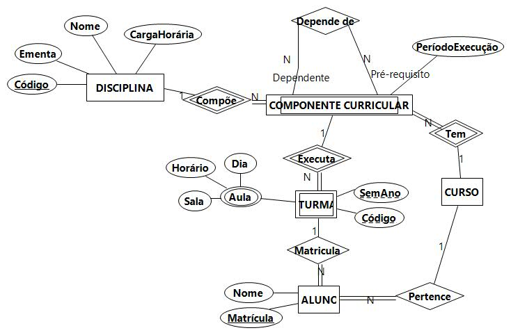

## [Tópico T03a] - Requisitos de Dados - BD Controle Acadêmico
###### *by Prof. Plinio Sa Leitao-Junior (INF/UFG)*

### Perfis de usuários

- Aluno
  - Quais as disciplinas que o aluno X pode matricular-se no semestre letivo X?
    - nome da disciplina, horários/salas, professor, ementa, código da turma, carga horária
  - Quais as disciplinas do aluno X com matrícula confirmada no semestre letivo X?
    - nome da disciplina, horários/salas, professor, ementa, código da turma, carga horária
  - Quais os alunos matriculados nas minhas disciplinas no semestre letivo X?
    - matrícula, nome
  - Qual o histórico de disciplina do aluno X?
    - dados do aluno, disiplinas cursadas com resultados, taxa de integralização
  - PENDENTE Quais as atividades, em aberto e finalizadas, em uma oferta de disciplina?
  - PENDENTE Quais os projetos de pesquisa e extensão do aluno x na data Y?

- Professor
  - Quais os alunos como maior número de faltas na turma X da disciplina Y (minha turma) no semestre letivo Z?
    - matrícula, nome, número de faltas

- Coordenador
  - Qual a quantidade de alunos ativos no curso?
  - Quais os alunos com expectiva para graduar-se até o semestre letivo X?
    - matricula, nome
  - Qual a matriz de disciplinas do curso X?
    - disicplina, período nominal de oferta, pré-requisitos entre disciplinas, carga horária da disciplina
  - PENDENTE Quais as disciplinas como monitoria em curso no Semestre X?

- Diretor
  - Qual a agenda de ensino do professor X no semestre letivo Y?
    - matrícula, nome, turmas/horários/salas

## Não há atividade para este tópico, excepcionalmente.
