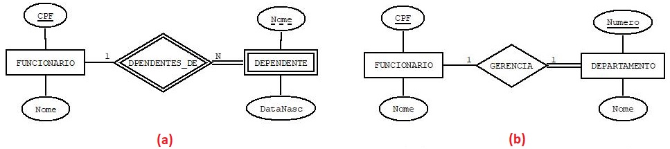

## [Tópico T17] - Modelo Entidade Relacionamento (MER) - Tipo de entidade fraca
###### *by Prof. Plinio Sa Leitao-Junior (INF/UFG)*

Vimos que todo tipo de entidade possui **atributo chave**, o qual é um dos atributos do tipo de entidade, ou uma composição de dois os mais atributos do tipo de entidade. Dois exemplos, respectivamente, são: *(i)* o atributo chave do tipo de entidade VEICULO é o atributo *Placa*; e *(ii)* o atributo chave de MUNICIPIO é composto pelos atributos *Nome da Cidade* e *Estado*.

Entretanto, pode ocorrer que *um tipo de entidade não possua atributo chave próprio*; noutras palavras, dentre os atributos do tipo de entidade, *não há candidatos para ser o atributo chave* (atributo isolado, ou composição de atributos). Nesse caso o tipo de entidade é denominado **Tipo de Entidade Fraca**. 
*Obs.:* Chamamos os *tipos de entidade que possuem atributo chave próprio* de **Tipo de Entidade Regular**.

Para ilustrar, considere os dois diagramas (DERs) mostrados a seguir.

Sobre o DER na Figura (a):
- FUNCIONARIO é um tipo de entidade regular, pois possui atributo chave dentre os seus atributos (no caso, o atributo *CPF*).
- **DEPENDENTE é um tipo de entidade fraca**, pois não possui atributo chave próprio: o atributo *Nome* (sublinhado com linha tracejada) não identifica um dependente, pois os requisitos de dados afirmam que:
  - pode haver dois dependentes com mesmo nome e data de nascimento;
  - um mesmo funcionário não pode ter dois dependentes com o mesmo nome.
-	DEPENDENTE tem **dependência de existência** com o tipo de relacionamento DEPENDENTES_DE (linha dupla entre ambos, pois há **restrição de participação total**), pois qualquer dependente deve estar associado a funcionário.
-	DEPENDENTES_DE é um **Tipo de Relacionamento de Identificação** (um losango com linha dupla), ou seja, é um tipo de relacionamento de identificação para DEPENDENTE.
- Dessa forma, **DEPENDENTE é identificado por: FUNCIONARIO (a partir de DEPENDENTES_DE) em conjunto com o atributo *Nome* em DEPENDENTE**.

Sobre o DER na Figura (b):
- Nem toda dependência de existência resulta em um tipo de entidade fraca. 
- DEPARTAMENTO tem restrição de participação total (dependência de existência) com respeito ao tipo de relacionamento GERENCIA, pois todo departamento deve ter gerente.
- Contudo, DEPARTAMENTO não é um tipo de entidade fraca, pois possui um atributo chave dentre os seus atributos (no caso, o atributo *Numero*).

**Outro exemplo.** Considere uma aplicação simples em que um usuário faz chamadas (ligações) para apresentar algum comentário ou reclamação. Cada chamada possui um registro de tempo (data e horário da ligação, com precisão de milissegundos), um motivo (comentário ou reclamação) e uma descrição. Se houver duas chamadas com o mesmo registro de tempo, tais chamadas devem ser de usuários distintos, ou seja, um mesmo usuário não pode fazer duas chamadas no mesmo registro de tempo (mas pode haver duas chamadas com mesmo registro de tempo). Dois projetistas distintos elaboraram duas soluções diferentes (dois esquemas conceituais), exibidos a seguir.

Sobre o DER na Figura (a):
- O atributo *DataHora* não é atributo chave de LIGACAO, pois duas ligações podem ter o mesmo registro de tempo se forem de usuários distintos.
- O tipo de entidade LIGACAO não possui um candidato a atributo chave, mesmo com a combinação de atributos (exemplos: *DataHora* e *Motivo*; *DataHora* e *Descricao*, etc.).
- Dessa forma, **LIGACAO é um tipo de entidade fraca** e **FAZ_CHAMADA é um tipo de relacionamento de identificação**: uma ligação é identificada pelo usuário em conjunto com o registro de tempo. 

Sobre o DER na Figura (b):
- O outro projetista criou um **atributo artificial** (um atributo ausente dos requisitos de dados), denominado *Ident*. 
- Dessa forma, LIGACAO não é um tipo de entidade fraca, pois cada entidade desse tipo é identificada pelo valor do atributo *Ident*.
- Atributos artificiais não fazem parte do domínio da aplicação.
- Apesar da decisão do projetista, vale ressaltar que, nesse caso, não há a necessidade de criar um atributo artifical para ser o atributo chave de LIGACAO, pois há alternativa posta no Diagrama (a).

Em ambas as soluções, LIGACAO possui dependência de existência com FAZ_CHAMADA:
- LIGACAO possui restricao de participação total com respeito ao tipo de relacionamento FAZ_CHAMADA (linha dupla entre ambos).
- Contudo, somente na primeira solução - Diagrama (a) - o tipo de entidade LIGACAO é um tipo de entidade fraca.
- Logo, dependência de existência não determina se uma entidade é fraca.

Outro assunto, você consegue interpretar o diagrama abaixo?

## Atividade (data limite: **12/08/2022 23h59min59s**)

Crie o diretório **topico-17** no seu repositório https://github.com/contagithub/bd-2022-1-bia, onde **contagithub** é o nome da conta do aluno no Github. Este é o repositório que você criou no início da disciplina.

Neste diretório você deverá depositar um arquivo JPG, contendo a imagem de um DER conforme solicitado na atividade. 
**Atenção às diretrizes abaixo**:
- Use a ferramenta que desejar, desde que a especificação do DER tenha **precisamente** a notação apresentada no [Tópico 15a](./topico-15a.md):
  - Sugestão 1: use a ferramenta [Dia](http://dia-installer.de/), que é uma ferramenta de desenho:
    - para especificar o DER, selecione a *Folha* **ER** (em vez da *Folha* **Banco de Dados**);
  - Sugestão 2: use a ferramenta [ERRCASE](https://sites.google.com/a/cin.ufpe.br/eercase/), que é uma ferramenta de 'modelagem' de banco de dados;
  - Independente da ferramenta utilizada, ao final exporte o desenho para um arquivo JPG.
- Ao 'depositar' o arquivo no diretório, checar se as dimensões da imagem do diagrama estão ajustadas à area de apresentação no GitHub (não deve ser muito pequeno a ponto de tornar-se ilegível, nem grande demais a ponto de ser necessário **rolar** (*to scroll*) para visualizar).
- Faça você mesmo, evite olhar respostas prontas.  Novamente, convém citar Cora Coralina para esclarecer o objetivo da atividade: "O que vale na vida não é o ponto de partida e sim a caminhada. Caminhando e semeando, no fim terás o que colher".

A atividade considera os requisitos de dados do **BD Campeonato de futebol**, que inclui as seguintes demandas informacionais:
1. Que times participaram do campeonato do Ano 2021?
1. Quais as datas das partidas ocorridas no campeonato do Ano 2020?
1. Quais os jogadores que participaram do Jogo X do campeonato do Ano 2021?
1. Quais os jogadores foram substituídos no Jogo X do campeonato do Ano 2020? Quem saiu, quem entrou, e em qual minuto.
1. Qual o placar do Jogo X do campeonato do Ano 2019? Que jogadores fizeram os gols?

Desenhe um DER capaz de atender todas as demandas informacionais acima: 
&#9786; É necessário 'desenhar' o DER completo.

## Artefatos

1. Diretório **topico-17**, criado no repositório do estudante, contendo um arquivo com a imagem JPG do DER solicitado.
