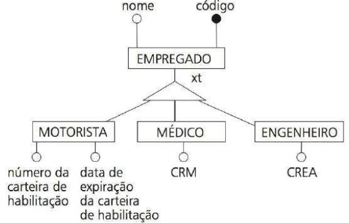
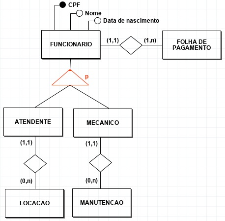

## [Tópico T20] - Modelo Entidade Relacionamento (MER) - Generalização/Especialização
###### *by Prof. Plinio Sa Leitao-Junior (INF/UFG)* &#9728;

O Modelo Entidade Relacionameno (MER) foi estendido para incluir os conceitos:
- subclasse e superclasse;
- especialização e generalização;
- herança de atributos e tipos de relacionamento.

### Primeiro exemplo

Seja o diagrama a seguir, referente a um trecho do DER pertinente ao banco de dados de uma empresa de recursos humanos terceirizados. 

A interpretação com respeito ao DER acima é:
- MOTORISTA, MEDICO e ENGENHEIRO são especializações (subclasses) de EMPREGADO.
- EMPREGADO é uma generalização (superclasse) de MOTORISTA, MEDICO e ENGENHEIRO.
- Qualquer motorista é um empregado, qualquer médico é um empregado e qualquer engenheiro é um empregado:
  - cada entidade que é membro de MOTORISTA é também membro de EMPREGADO.
  - cada entidade que é membro de MEDICO é também membro de EMPREGADO.
  - cada entidade que é membro de ENGENHEIRO é também membro de EMPREGADO.
- **Herança de atributos** - as subclasses herdam os atributos da superclasse:
  - MOTORISTA tem os atributos _código_, _nome_, _número da carteira de habilitação_ e _data de expiração da carteira de habilitação_.
  - MEDICO tem os atributos _código_, _nome_ e _CRM_.
  - ENGENHEIRO tem os atributos _código_, _nome_ e _CREA_.
- Conforme a notação adotada no diagrama, o triângulo representa a hierarquia de generalização/especialização - observe as letras "**xt**" ao lado do triângulo:
  - a presença da letra "**t**" denota que **a generalização é *T*otal**:
    - cada entidade na superclasse necessariamente é membro de pelo menos uma subclasse;
    - noutras palavras, cada empregado é motorista, médico e/ou engenheiro.
  - a presença da letra "**x**" denota que **a especialização é e*X*clusiva**:
    - toda entidade da superclasse é membro de, no máximo, uma subclasse;
    - noutras palavras, um mesmo empregado **não** pode ter duas ou mais especializações concomitantes (tal como ser médico e também engenheiro).

### Segundo exemplo

Seja o BD Locadora de Veículos, que tem os requisitos de dados introduzidos no [Tópico 03b](./topico-03b.md). Considere o tipo de entidade FUNCIONARIO, cujo significado é **conjunto de funcionários** da locadora. Segundo os requisitos de dados, há várias categorias de funcionários, a saber: administrador, atendente, gerente financeiro e mecânico. Contudo, há subgrupos (subtipos) de funcionários que são significativos para a aplicação e precisam ser representados explicitamente, por causa de sua importância com relação ao conteúdo do banco de dados: esses subgrupos de funcionários são ATENDENTE e MECANICO. A figura a seguir ilustra esta generalização/especialização aplicada ao BD Locadora de Veiculos.

A interpretação com respeito ao DER acima é:
- ATENDENTE e MECANICO são especializações (subclasses) de FUNCIONARIO.
- FUNCIONARIO é uma generalização (superclasse) de ATENDENTE e MECANICO.
- Qualquer atendente é um funcionário, e qualquer mecânico é um funcionário:
  - cada entidade que é membro de ATENDENTE é também membro de FUNCIONARIO.
  - cada entidade que é membro de MECANICO é também membro de FUNCIONARIO.
- Herança de **tipos de relacionamento** - as subclasses participam dos tipos de relacionamento da superclasse:
  - ATENDENTE participa dos tipos de relacionamento com FOLHA DE PAGAMENTO e LOCACAO.
  - MECANICO participa dos tipos de relacionamento com FOLHA DE PAGAMENTO e MANUTENCAO.
- Conforme a notação empregada no diagrama, o triângulo representa a hierarquia de generalização/especialização - observe a letra "**p**" ao lado do triângulo:
  - a presença da letra "**p**" denota que **a generalização é parcial**:
    - há entidades na superclasse que são membros de pelo menos uma subclasse, mas há entidades na superclasse que não são membros de qualquer subclasse;
    - noutras palavras, pode haver funcionários que não são atendentes nem mecânicos.
  - a ausência da letra "**x**" denota que **a especialização não é e*X*clusiva**, ou seja, **é sobreposta**:
    - pode haver entidades na superclasse que são membros de mais de uma subclasse;
    - noutras palavras, pode haver funcionários que são atendentes e mecânicos.

### Reflexões ...

Pelos dois exemplos apresentados acima, as seguintes reflexões são importantes:
- ***Especialização*** é o processo de definir subconjuntos a partir das entidades de um tipo de entidade:
  - O tipo de entidade que origina esses subconjuntos é denominado **superclasse** (ou **tipo de entidade genérica**).
  - Cada subconjunto é denominado **subclasse** (ou **tipo de entidade especializada**).
- ***Generalização*** é o processo de abstrair um **tipo de entidade genérica** a partir de **tipos de entidade especializadas**:
  - Especialização e generalização representam um mesmo conceito com pontos de vista invertidos.
- Uma ***hierarquia de generalização/especialização*** é caracterizada pelo tipo de entidade genérica e pelos tipos de entidade especializadas:
  - Cada hierarquia possui um significado:
    - por exemplo, no segundo exemplo acima (BD Locadora de Veículos), o significado da hierarquia é **subconjuntos de empregados agrupados pelo cargo**.
  - Hierarquias de generalização/especialização ***são motivadas*** com base em algumas ***características distintivas*** das entidades dos subconjuntos especializados, em relação às entidades do tipo de entidade genérica:
    - no primeiro exemplo acima, MOTORISTA, MEDICO E ENGENHEIRO são subconjuntos de EMPREGADO, os quais são caracterizados por terem atributos particulares, tais como CRM e CREA para MEDICO e ENGENHEIRO, respectivamente;
    - no segundo exemplo acima, ATENDENTE e MECANICO são subconjuntos de FUNCIONARIO, os quais são caracterizados por participarem em tipos de relacionamentos particulares, tais como as associações com LOCACAO e MANUTENCAO, respectivamente.
  - Os tipos de entidades especializadas (subclasses) herdam do tipo de entidade genérica (superclasse):
    - os atributos; e 
    - as participações em tipos de relacionamento.
  - as restrições cabíveis a hierarquias de generalização/especialização são:
    - **restrição de exclusividade de especialização**:
      - especialização exclusiva; ou 
      - especialização sobreposta (não exclusiva).
    - **restrição de completude de generalização**:
      - generalização completa; ou
      - generalização parcial.
    - As restrições de **exclusividade de especialização** e de **completude de generalização** são independentes entre si. Então há 04 (quatro) possíveis combinações para qualquer hierarquia:
      - exclusiva e completa;
      - exclusiva e parcial;
      - sobreposta e completa;
      - sobreposta e parcial.
  - Hierarquias de generalização/especialização podem ser aninhadas. 

### Exercício

Seja o diagrama a seguir [1], que possui hierarquias de generalização/especialização:

Observe que uma nova notação para o DER é usada para representar hierarquias de generalização/especialização:
- SECRETARIA, TECNICO e ENGENHEIRO são tipos de entidade especializadas em relação a FUNCIONARIO:
  - o significado desta hierarquia é **subconjuntos de empregados agrupados pelo cargo**.
- Sobre a **restrição de exclusividade de especialização**:
  - a letra "d" (do inglês, _disjoint_) indica ***especialização exclusiva***;
  - a letra "o" (do inglês, _overlapping_) indica ***especialização sobreposta***.
- Sobre a **restrição de completude de generalização**:
  - a linha dupla que liga a superclasse à hierarquia indica ***generalização total***;
  - a linha simples que liga a superclasse à hierarquia indica ***generalização parcial***.
- Então a hierarquia que define SECRETARIA, TECNICO e ENGENHEIRO possui _especialização exclusiva_ e _generalização parcial_.

Analise as afirmações a seguir:

1. Há duas hierarquias do tipo generalização/especialização? (Responda Sim ou Não)
1. É possível inserir um funcionário cujo cargo não é _secretária_, _técnico_ e _engenheiro_ (por exemplo, _médico_)? (Responda Sim ou Não)
1. Todo funcionário é secretária, técnico ou engenheiro? (Responda Sim ou Não)
1. Um funcionário horista pode ser gerente de projeto? (Responda Sim ou Não)
1. Uma secretária pode ser gerente de projeto de projeto? (Responda Sim ou Não)
1. Um engenheiro pode ser horista? (Responda Sim ou Não)
1. TECNICO e ENGENHEIRO representam dois subconjuntos disjuntos? (Responda Sim ou Não)
1. ENGENHEIRO e GERENTE representam dois subconjuntos disjuntos? (Responda Sim ou Não)

## Atividade (data limite: **02/09/2022 23h59min59s**)

Crie o diretório **topico-20** no seu repositório https://github.com/contagithub/bd-2022-1-bia, onde **contagithub** é o nome da conta do aluno no Github. Este é o repositório que você criou no início da disciplina.

Neste diretório você deverá depositar um arquivo JPG, contendo a imagem de um DER conforme solicitado na atividade. 
**Atenção às diretrizes abaixo**:
- Use a ferramenta que desejar, desde que a especificação do DER tenha **precisamente** a notação apresentada no [Tópico 15a](./topico-15a.md):
  - Sugestão 1: use a ferramenta [Dia](http://dia-installer.de/), que é uma ferramenta de desenho:
    - para especificar o DER, selecione a *Folha* **ER** (em vez da *Folha* **Banco de Dados**);
  - Sugestão 2: use a ferramenta [ERRCASE](https://sites.google.com/a/cin.ufpe.br/eercase/), que é uma ferramenta de 'modelagem' de banco de dados;
  - Independente da ferramenta utilizada, ao final exporte o desenho para um arquivo JPG.
- Ao 'depositar' o arquivo no diretório, checar se as dimensões da imagem do diagrama estão ajustadas à area de apresentação no GitHub (não deve ser muito pequeno a ponto de tornar-se ilegível, nem grande demais a ponto de ser necessário **rolar** (*to scroll*) para visualizar).
- Faça você mesmo, evite olhar respostas prontas.  Novamente, convém citar Cora Coralina para esclarecer o objetivo da atividade: "O que vale na vida não é o ponto de partida e sim a caminhada. Caminhando e semeando, no fim terás o que colher".

A atividade considera o esquema lógico do BD Biblioteca, conforme a figura abaixo.

1. Desenhe um DER para o BD Biblioteca, o qual pode ser mapeado para obter o esquema lógico do BD Biblioteca. Trata-se de **Engenharia reversa?**
1. [Opcional] Você pode apresentar uma solução alternativa (em adição à resposta para a Questão 1)?

RESPOSTA: 
Uma resposta está [aqui](https://github.com/GabrielvanderSchmidt/bd-2022-1-bia/tree/main/topico-20).

1. Inconsistências ao aplicar o Modelo Entidade Relacionamento, tais como ausência de atributo chave, associação direta entre tipos de entidade (sem tipo de relacionamento), emprego incorreto de tipo de entidade fraca, tipo de relacionamento sem cardinalidade, uso de 'chaves estrangeiras', etc.  [exemplo](https://github.com/alerhandramg/bd-2022-1-bia/issues/2) [exemplo](https://github.com/alessandra30smorais/bd-2022-1-bia/issues/3) [exemplo](https://github.com/elisayumi/bd-2022-1-bia/blob/main/T%C3%B3pico%2020.png) [exemplo](https://github.com/EryKoston/bd-2022-1-bia/blob/main/T%C3%B3pico20.jpeg) [exemplo](https://github.com/reisguilherme/bd-2022-1-bia/blob/main/Topico%2020/Topico%2020.png) [exemplo](https://github.com/Isadoramesquitaa/bd-2022-1-bia/blob/main/Topico-20.jpeg) [exemplo](https://github.com/Gusreis7/bd-2022-1-bia/blob/main/topico20/topico20.md) [exemplo](https://github.com/iagoalvesb/bd-2022-1-bia/blob/main/Topico_20.png) [exemplo](https://github.com/kauandivino/bd-2022-1-bia/blob/master/topico-20/topico_20.jpg) [exemplo](https://github.com/LuanGOliviera/bd-2022-1-bia/issues/3) [exemplo](https://github.com/lucca11235/bd-2022-1-bia/blob/main/To%CC%81picos/To%CC%81pico-20/to%CC%81pico%2020.jpg) [exemplo](https://github.com/GO0108/bd-2022-1-bia/blob/main/Topico%2020.jpg) [exemplo](https://github.com/omatheusbrandao/bd-2022-1-bia/blob/main/T%C3%B3pico%2020.jpg) [exemplo](https://github.com/Murilovisk0/bd-2022-1-bia/blob/main/topico-20.md) [exemplo](https://github.com/pedr0p7/bd-2022-1-bia/issues/3) [exemplo](https://github.com/RafaelGoias/bd-2022-1-bia/blob/main/T%C3%B3pico%2020.jpg) [exemplo](https://github.com/victoremanuelgo/bd-2022-1-bia/blob/main/T%C3%B3pico%2020/BD_Biblioteca.png) [exemplo](https://github.com/pvzinn/bd-2022-1-bia/blob/main/topico-20.png) SEM APROVEITAMENTO

## Artefatos

1. Diretório **topico-20**, criado no repositório do estudante, contendo um arquivo com a imagem JPG do DER solicitado.

### Bibliografia

[1] ELMASRI, R.; NAVATHE, S. B. Sistemas de Banco de Dados. 6. ed. Pearson, 2011.
